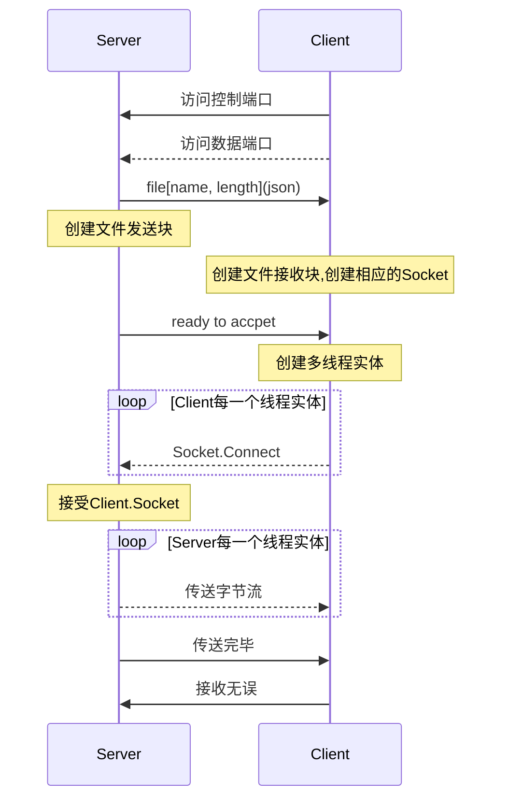

```mermaid
sequenceDiagram
participant s as Server
participant c as Client
c->>s:访问控制端口
c-->>s:访问数据端口

s->>c:file[name, length](json)
note over s:创建文件发送块
note over c:创建文件接收块,创建相应的Socket
s->>c:ready to accpet
note over c:创建多线程实体
	loop Client每一个线程实体
		c-->>s:Socket.Connect
	end
note over s:接受Client.Socket
	loop Server每一个线程实体
		s-->>c:传送字节流
	end
s->>c:传送完毕
c->>s:接收无误
```

