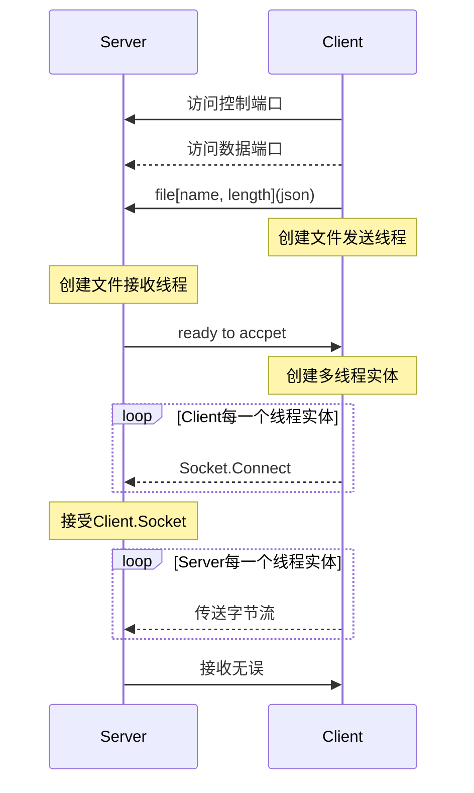

### 传输时序



### 开发手册

error::connection_reset(远程主机强迫关闭了一个现有的连接)
error::connection_aborted(你的主机中的软件中止了一个已建立的连接)

DownWork==>UpWork:

```json
{
	"progress":"int: 接收进度",
}
```

Scan:

```json
{
    "BROADCAST":"BROADCAST"
}
```

Respond:

```json
{
    "RESPONSE":"RESPONSE"
}
```


### 疑问

* TCP前提下, 服务端`accpet()`产生的多个`socket::port`都是相同的, 那么系统怎么正确分发来自客户端的数据包?
  答: 根据`TCP`四元组`{源ip,源port,目标ip,目标port}`, 即使客户端的数据包中`{目标ip,目标port}`相同, 服务端也可以根据`{源ip,源port}`正确分发.(客户端`connect()`返回的`socket::port`是随机且不相同的, 由操作系统分配)
* TCP前提下, 服务器多`socket`绑定一个端口, 会影响并发传输的速度吗?
  答: 端口并不实际存在, 是为了分派数据给应用程序而抽象的概念, 其与物理设备是多对一关系(一个`ip`对应多个`port`), 并发传输只受物理因素影响.

