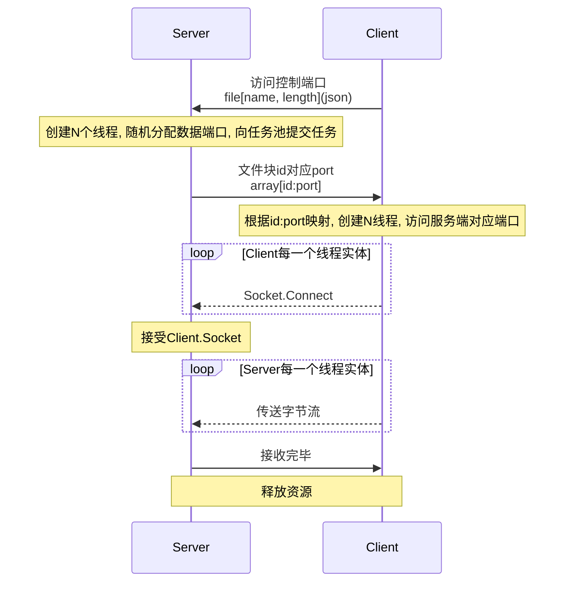

# 多线程网络文件传输

### 传输时序



`DownWork`==>`UpWork`:

```json
{
	"progress":"int: 接收进度",
}
```

`Scan`

```json
{
    "TYPE":"SCAN",
}
```

`Respond`:

```json
{
    "TYPE":"RESPOND",
}
```

`send`:

```json
{
    "FILENAME":"string, 文件名称",
    "FILESIZE":"uint64, 文件大小"
}
```

`tcplisten`:

```json
[
    {
       "ID":"int, 文件块id",
       "PORT":"int, 端口号"
    }
    // ...
]
```


`App CMD`:

> * ~~`help`: 获取帮助~~
> * `scan`: 扫描局域网, 获得局域网内设备`ip`
> * ~~connect [ip]: 连接到ip~~
> * `send [file] [ip]`: 发送文件`[file]`到`[ip]`
> * `exit`: 程序退出
