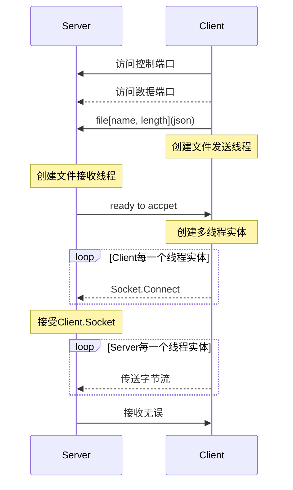

### 传输时序



### 开发手册

error::connection_reset(远程主机强迫关闭了一个现有的连接)
error::connection_aborted(你的主机中的软件中止了一个已建立的连接)

`DownWork`==>`UpWork`:

```json
{
	"progress":"int: 接收进度",
}
```

`Scan`

```json
{
    "TYPE":"SCAN",
}
```

`Respond`:

```json
{
    "TYPE":"RESPOND",
}
```

`send`:

```json
{
    "FILENAME":"string",
    "FILESIZE":int
}
```

`tcplisten`:

```json
[
    {
       "ID":int,
       "PORT":int
    }
    ...
]
```


`App CMD`:

> * `help`: 获取帮助
> * `scan`: 扫描局域网, 获得局域网内设备`ip`
> * ~~connect [ip]: 连接到ip~~
> * `send [file] [ip]`: 发送文件`[file]`到`[ip]`
> * `exit`: 程序退出

